# 🏭 Agent Factory

Agent Factory is a standalone workflow library and CLI for orchestrating AI
agents and repeatable processes. Model work as a graph, run it in any project,
and inspect execution through the dashboard and event timeline.

## 🤔 Why?

Agent Factory makes recurring engineering workflows explicit. Instead of
relying on one-off prompts or tribal knowledge, you can define work types,
states, workers, and review loops once and reuse them across projects.

Checklists improve outcomes even for expert teams; the same principle applies
to software workflows. [Checklists reduced surgical mortality by
47%](https://en.wikipedia.org/wiki/The_Checklist_Manifesto).


## 📦 Install

1. Install the local Codex provider used by your environment and authenticate it.

2. Build and install the binary:
```bash
git clone https://github.com/portpowered/agent-factory.git
cd agent-factory
make install     # installs to $GOBIN
```


## 🚀 Quickstart

1) Go to the repository where you want to run the workflow:
```bash
cd ~/src/sample-project
```

2) Start the default starter factory:
```bash
agent-factory
```

With no arguments, `agent-factory` creates or reuses `./factory`, starts continuous mode, and reports the dashboard at `http://localhost:7437/dashboard/ui`.

If you want to scaffold the starter layout without launching the runtime, use:
```bash
agent-factory init
agent-factory init --executor claude --dir my-factory
```

Supported starter scaffold options are `codex` and `claude`.

3. Add a Markdown task from another terminal:
```bash
printf "Fix the lint issues\n" > factory/inputs/tasks/default/my-request.md
```

The factory watches `factory/inputs/tasks/default`, picks up new Markdown or
JSON files, and dispatches them through the default Codex-backed workflow.

If you want to create the starter files explicitly before you run the factory, use `agent-factory init`:

```bash
# Default starter scaffold (Codex-backed)
agent-factory init

# Claude-backed default scaffold
agent-factory init --executor claude --dir my-factory

# Dedicated Ralph scaffold
agent-factory init --type ralph --dir ralph-factory
agent-factory run --dir ralph-factory
printf "Create a minimal release-planning loop for a document processing service.\nGenerate a human-readable PRD, a matching Ralph JSON plan, and an execution loop that completes one story per iteration until the work is done.\nKeep the plan product-neutral unless the customer request names a specific product.\n" > ralph-factory/inputs/request/default/release-planning-loop.md
```

Omitting `--executor` keeps the default Codex-backed starter. Supported starter options are `codex` and `claude`.
The generated Ralph scaffold turns requests from `ralph-factory/inputs/request/default` into `prd.md`, `prd.json`, and `progress.txt`, then iterates one story at a time until completion. It intentionally excludes reviewer, thoughts or ideation, and cron stages.

If you need the packaged reference pages from the installed binary, use the
built-in docs command:

```bash
agent-factory docs
agent-factory docs workstation
agent-factory docs batch-work
```

Supported docs topics are `config`, `workstation`, `workers`, `resources`,
`batch-work`, and `templates`.
## ⚙️ How It Works

The factory ingests files or API submissions as work items, then moves that
work through workstations that run workers and change the work state.

The default no-argument starter flow looks like this:

```mermaid
flowchart LR
   classDef place fill:#000,stroke:#333,stroke-width:2px
   classDef transition fill:#333,stroke:#333,color:#fff,rx:0,ry:0

   P0((tasks:init)):::place
   P1((tasks:complete)):::place
   P2((tasks:failed)):::place

   T0[process]:::transition

   P0 --> T0
   T0 --> P1
   T0 -.->|on failure| P2

```


From there, you can build multi-step pipelines, review loops with rejection
feedback, fan-out/fan-in, and guarded loop breakers.

- See [authoring-workflows](./docs/authoring-workflows.md) for the full configuration guide.
- See [examples/simple-tasks](./examples/simple-tasks/README.md) for a runnable review-loop example.


## 🖥️ CLI Commands

```bash
agent-factory          # Bootstrap ./factory and keep the default factory running
agent-factory docs     # List packaged markdown reference topics
agent-factory docs config  # Print the packaged config reference page
agent-factory init     # Create the default single-step scaffold (--executor codex|claude, default: codex)
agent-factory init --type ralph --dir ralph-factory  # Create the minimal Ralph PRD-to-execution scaffold
agent-factory run      # Load workflow and run the factory engine in explicit batch mode
agent-factory config flatten ./factory  # Write canonical camelCase single-file factory JSON to stdout
agent-factory config expand ./factory.json  # Write split factory files beside factory.json
agent-factory submit --work-type-name <work-type-name> --payload <path>  # Submit work to a running factory
```

Supported docs topics are `config`, `workstation`, `workers`, `resources`,
`batch-work`, and `templates`. Each topic prints the packaged markdown page
directly from the installed binary, so the command still works outside a
repository checkout.

Work submission uses `--work-type-name` and API request bodies use `work_type_name`. Factory config examples and `config flatten` output use camelCase keys such as `workTypes`, `resources`, and `workingDirectory`.
For portable script-backed factories, keep workstation runtime config inline in
`factory.json` with a field such as `type: "MODEL_WORKSTATION"`. Set
`workstations[].copyReferencedScripts: true` only when expanded layouts should
copy supported relative script files into the output bundle.
For portable checked-in factory layouts, `config flatten` also bundles the
documented factory-local files from `factory/scripts/**`, `factory/docs/**`,
and supported root helper files such as `Makefile` into
`resourceManifest.bundledFiles`. `config expand` restores those files beside the
expanded `factory.json` and split `AGENTS.md` files, and `LoadRuntimeConfig(...)`
materializes the same bundled files when a standalone portable `factory.json`
is loaded directly. Restored bundled `SCRIPT` files keep executable permissions
on Unix-like systems so direct-exec script workflows still run after roundtrip.
Both paths reject absolute or escaping bundled-file targets instead of writing
outside the factory root. See
[Config Reference](./docs/reference/config.md#portable-bundled-files) for the
canonical roundtrip example.

Common flags:
- `--dir <path>` — factory base directory (default: `factory`)
- `--with-mock-workers [config]` — test workflows with deterministic mock workers; omit `config` for default accept behavior. See [Test Workflows With Mock Workers](./docs/authoring-workflows.md#test-workflows-with-mock-workers).
- `--work <path>` — path to an initial `FACTORY_REQUEST_BATCH` JSON file to submit on startup
- `--record <path>` — stream a replay artifact for the current run
- `--replay <path>` — replay a run from an existing replay artifact
- `--port <port>` — HTTP port for the API and embedded dashboard shell (default: `7437`)
- `--runtime-log-dir <path>` — structured runtime log directory (default: `~/.agent-factory/logs`)
- `--runtime-log-max-size-mb <n>` — rotate each runtime log file after this many megabytes (default: `100`)
- `--runtime-log-max-backups <n>` — maximum rotated runtime log files to retain (default: `20`)
- `--runtime-log-max-age-days <n>` — maximum days to retain rotated runtime log files (default: `30`)
- `--runtime-log-compress` — gzip rotated runtime log files

The default dashboard shell is served from `http://localhost:7437/dashboard/ui`. Custom ports use `http://localhost:<port>/dashboard/ui`.

Runtime logs are structured JSON rolling files. Replay artifacts use the same canonical event timeline as `/events` and may include rendered model prompts in `INFERENCE_REQUEST` events. Environment diagnostics such as `env_count` and `env_keys` are recorded in replay diagnostics rather than duplicated in system runtime events. Successful commands suppress stdout and stderr in system logs; failed commands keep output context for troubleshooting. Verbose mode may still emit explicit command detail events.

## 🔑 Key Concepts

- 🗂️ **Work types** — categories of work (e.g., `task`, `story`, `request`). Denotes what states each piece of work can have. 
- 👷 **Workers** — executors that do the work. Works on work. 
- 🔧 **Workstations** — Places that transform work. Workers work at workstations to change work from one state to another. 
- 🧰 **Resources** — concurrency constraints (e.g., limit simultaneous agent slots).
- 🏭 **Factory** — the complete system: work, workers, workstations, resources.

## 📁 Directory Structure

A factory is a self-contained directory:

```
sample-factory/
├── factory.json        # Workflow definition: work types, workers, workstations, resources
├── inputs/             # Drop files here to submit work
│   └── <work-type>/    # One directory per work type
│       └── <channel>/  # Optional channel subdirectory (defaults to "default")
├── workers/
│   └── <worker-name>/
│       └── AGENTS.md   # Worker configuration (model, modelProvider, executorProvider, system prompt)
└── workstations/
    └── <station-name>/
        └── AGENTS.md   # Task instructions (prompt template with variable substitution)
```

## 💡 Example Factories

### 🏗️ Default init scaffold

Created or reused by `agent-factory` or `agent-factory init`. A single-step
workflow: `tasks:init` → worker → `tasks:complete` (or `tasks:failed`). Submit
Markdown or JSON tasks under `factory/inputs/tasks/default`.

### 🧭 Ralph scaffold

Created by `agent-factory init --type ralph --dir <dir>`. A distinct minimal PRD-to-execution scaffold with `plan-request` and repeatable `execute-story` stages. Submit initial requests under `<dir>/inputs/request/default`.

### 🧭 Checked-in repository workflow

This repository also ships a richer checked-in starter under [`./factory/`](./factory/README.md).
It is not the default `agent-factory init` scaffold. The checked-in tree uses a
repository-local plan-and-task workflow with workspace setup, execution,
review, and guarded loop breakers. Seed checked-in repository work under `factory/inputs/plan/default`.
The canonical checked-in inbox directories are kept in git with `.gitkeep`
sentinels so the root workflow surface exists in clean checkouts.

See [factory/README.md](./factory/README.md) for the checked-in starter layout.

### 🧪 Shipped example factories

- [examples/basic/factory](./examples/basic/factory/README.md) — minimal
  single-step task workflow.
- [examples/simple-tasks](./examples/simple-tasks/README.md) — execution and
  review loop with guarded loop breakers.
- [examples/write-code-review](./examples/write-code-review/README.md) —
  structured input and code-review workflow example.
- [examples/thought-idea--plan-work-review](./examples/thought-idea--plan-work-review/README.md) —
  multi-stage idea, planning, and review workflow.

## 🛠️ Development

Start with the [Agent Factory Development Guide](./docs/development/development.md) before changing runtime code, workflow behavior, dashboard assets, replay, or tests. It owns the local command list, package-specific verification gates, and Agent Factory gotchas.

### 🔨 Build and test

GitHub Actions CI for this repository lives in [`.github/workflows/ci.yml`](./.github/workflows/ci.yml). It runs on pull requests and branch pushes, validates the current build, lint, API, and test surfaces, and intentionally stops short of deployment automation in this first pass.

To reproduce the CI lanes locally from the repository root, run the same commands in workflow order:

1. `cd ui && bun install --frozen-lockfile`
2. `cd ui && bun run tsc`
3. `make build`
4. `make ui-build`
5. `make lint`
6. `make api-smoke`
7. `make ui-test`
8. `make test`

For dashboard review readiness after UI source changes that affect embedded assets, run the serialized verification target:

```bash
make dashboard-verify # Rebuild dashboard assets, then run Go vet and short tests
```

`dashboard-verify` prevents Vite hashed asset churn in `ui/dist/` from racing with Go embed scanning during `go vet` or `go test`. Use the focused targets below when you are iterating on only one step.

For standalone release-surface readiness after changing customer-facing docs, examples, or scaffold content, run:

```bash
make release-surface-smoke # Prove the README, starter flows, shipped examples, init output, and public-surface guard stay product-agnostic
```

For public OpenAPI or event-contract changes, edit `api/openapi-main.yaml` or a referenced fragment such as `api/components/schemas/events/`, then rebundle and regenerate from `libraries/agent-factory` before review:

1. `make bundle-api`
2. `make generate-api`
3. `make api-smoke`

`api/openapi.yaml` is the bundled published artifact consumed by generation and downstream readers. Do not hand-edit that file.
`make bundle-api` and `make api-smoke` run Redocly from the root `api/` workspace so the package-local flow stays on the repository-owned `api/redocly.yaml` configuration.

```bash
make build       # Build agent-factory binary to bin/
make bundle-api  # Bundle authored OpenAPI sources into api/openapi.yaml
make generate-api # Regenerate OpenAPI-derived server interfaces and models
make api-smoke   # Lint, bundle, regenerate twice, run the bundled event-contract guard, and verify outputs stay clean
make install     # Install agent-factory to $GOBIN
make release-surface-smoke # Run the standalone release-surface smoke path
make test        # Run focused short Go tests
make test-race   # Run tests with race detector
make lint        # Run go vet and deadcode baseline drift check
make fmt         # Format code
make ui-deps     # Install dashboard UI dependencies with Bun's frozen lockfile
make ui-build    # Focused rebuild of embedded dashboard assets
make ui-test     # Run dashboard UI tests
make ui-storybook # Build dashboard Storybook static assets
make ui-test-storybook # Run dashboard Storybook browser interaction checks
```

### 🖥️ Dashboard UI development

The standalone browser dashboard lives under `ui/`; start with its [`package.json`](./ui/package.json). Production builds are emitted to `ui/dist/` and embedded into the Go binary; the API server serves that shell at `/dashboard/ui`.

Dashboard Storybook interaction checks are also owned by `ui/`. Build the static catalog with `make ui-storybook`, then run `make ui-test-storybook` to serve `ui/storybook-static` on the dashboard runner port and execute package-local story play functions. Keep dashboard runner setup, base-path handling, and API mocks separate from `website/.storybook`.

See [Live dashboard](./docs/development/live-dashboard.md) for the canonical guide covering:

- embedded production-style serving from `/dashboard/ui`
- local Vite development against a running factory instance
- the shared dashboard snapshot API and SSE update flow
- read-model ownership and current dashboard constraints

### 📦 Dependencies

```bash
make deps        # Download dependencies
make deps-tidy   # Tidy go.mod
make ui-deps     # Install dashboard UI dependencies from ui/bun.lock
```

## 📚 Documents

- [The zen of flow](./docs/the-zen-of-flow.md) — process modeling based on management/operations theory.
- [Development guide](./docs/development/development.md) — local commands, verification gates, and package-specific gotchas.
- [API inventory](./docs/development/api-inventory.md) — observed HTTP API behavior that anchors the current OpenAPI contract.
- [Authoring workflows](./docs/authoring-workflows.md) — how to configure `factory.json` workflows.
- [Authoring AGENTS.md](./docs/authoring-agents-md.md) — how to write AGENTS.md files for workers and workstations.
- [Workstation types](./docs/workstations.md) — standard, repeater, cron, internal time work, and worktree execution behavior.
- [Timeout and failure behavior](./docs/authoring-agents-md.md#timeout-and-failure-behavior) — where to configure execution timeouts, which normalized failures retry, and when a provider/model lane pauses for 5 hours by default.
- [Prompt variables](./docs/prompt-variables.md) — all variables available in workstation prompt templates.
- [Architecture](./docs/development/architecture.md) — internal package design and dependency graph.
- [Dashboard UI workflow baseline](./docs/development/dashboard-ui-workflow-baseline.md) — current dashboard UI compile, test, Storybook, Make target, and embed-path command inventory.
- [Dashboard UI Bun validation](./docs/development/dashboard-ui-bun-validation.md) — Bun compatibility proof for the dashboard UI TypeScript, Vite, Vitest, Storybook, and Go embed paths.
- [Run timeline](./docs/run-timeline.md) — how to understand a run as one ordered event timeline.
- [Live dashboard](./docs/development/live-dashboard.md) — how to run, understand, and extend the embedded dashboard.
- [Record and replay](./docs/record-replay.md) — how to capture, replay, and interpret event-log replay artifacts.

## ✨ Features

- 🔗 Complex graph handling for modelling various workflows
- 🔗 Validation mechanisms (boundedness, reachability, type-safety)
- 👁️ File watcher for automatic work submission
- ⏰ Worker-backed cron schedule workstations with internal time work, optional startup trigger, and stale tick expiry
- 📊 Session metrics and terminal dashboard
- 🧪 Mock-worker mode for testing token flow through the normal worker pool and command-runner boundary
- 🔌 Circuit breaker and cascading failure handling

### 🗺️ Planned

- 💾 Checkpointing
- 🌐 HTTP API for runtime work submission and status queries

- ⏱️ Tick-based execution engine with configurable scheduling (FIFO, enablement-based)
- 📈 Metrics visualization
- ⏰ Durable cron catch-up after downtime
- 🌍 Distributed execution
- 💰 Cost measurement
- 🤖 Support for additional agent providers

## 📖 References

#### 📚 Books
- [The New Economics for Industry, Government, and Education](https://www.amazon.com/New-Economics-Industry-Government-Education/dp/0262541165)
- [The Goal](https://www.amazon.com/Goal-Process-Ongoing-Improvement/dp/0884271951)
- [The Phoenix Project](https://www.amazon.com/Phoenix-Project-DevOps-Helping-Business/dp/0988262592)

#### 🔬 Research
- [Process ensures quality](https://www.scirp.org/journal/paperinformation?paperid=44261)
- [DORA 2021: deploys, quality, failure rates, recovery time](https://dora.dev/research/2021/dora-report/2021-dora-accelerate-state-of-devops-report.pdf)
- [Empirical analysis of process management](https://www.sciencedirect.com/science/article/abs/pii/S0272696300000292)

### 💻 Coding references
- [Gastown — an opinionated system for agent management](https://github.com/steveyegge/gastown)
