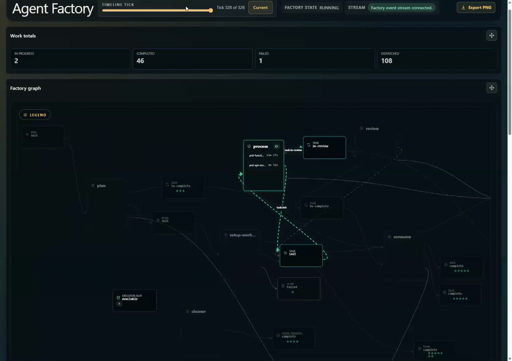
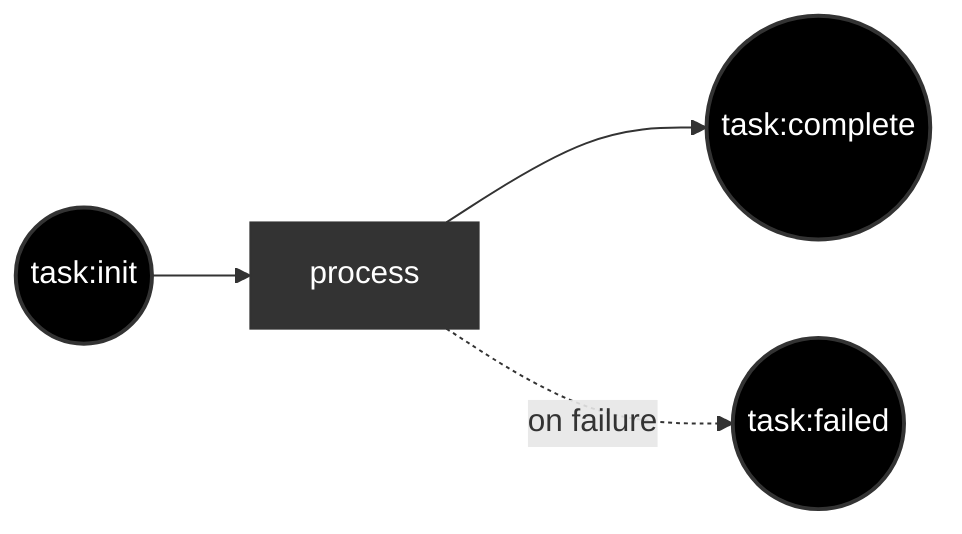

# Infinite You

Infinite you is an agent-factory, it orchestrates AI agents for you, so you
can do more work without doing anything. 

## Why?

As engineers push to use more AI, they are using a lot of brain power
manually managing 1-8 agents. With __Infinite You__, you get the agents coordinate/write code/review for you. You write out how the flow should work, give the agents instructions and they run. 
That way, you can run 10-100+ agents at once, and have even more leverage to do more stuff.

## 📦 Install

Install the local Codex provider used by your environment and authenticate it
first, then choose the install path that matches your machine.

### Homebrew cask for macOS

Use Homebrew when you are on macOS and want the standard package-manager flow:

```bash
brew install --cask portpowered/cask/agent-factory
```

The cask installs the packaged `agent-factory` release binary into Homebrew's
normal binary location. The binary is not code signed or notarized yet. The
cask tries to clear the macOS quarantine attribute automatically, but if macOS
still blocks launch run:

```bash
xattr -dr com.apple.quarantine "$(brew --prefix)/bin/agent-factory"
```

### `install.sh` for macOS and Linux

Use the hosted installer when you want the packaged release binary without
manual archive selection or unpacking:

```bash
curl -fsSL https://github.com/portpowered/infinite-you/releases/latest/download/install.sh | sh
```

`install.sh` supports macOS and Linux on `amd64` and `arm64`, verifies the
published checksum before extraction, installs into a user-writable directory,
and prints the final binary path plus `PATH` guidance when needed. On macOS it
also prints the exact `xattr` command above if quarantine removal still needs a
manual retry.

### `go install` for Go toolchain users

Use `go install` only when you already have a working Go toolchain and want the
CLI built from source instead of the packaged release artifact:

```bash
go install github.com/portpowered/infinite-you/cmd/factory@latest
```

This path installs the current `cmd/factory` entrypoint from source. Because
`go install` names the binary from the leaf package directory, this command
installs `factory` into your `GOBIN` rather than `agent-factory`.

### Manual release archive fallback

If you cannot use Homebrew, `install.sh`, or `go install`, you can still
download a release archive manually from GitHub Releases, unpack it, and place
`agent-factory` on your `PATH`.

If you are working from a local checkout instead, build and install the binary:

```bash
git clone https://github.com/portpowered/infinite-you.git
cd infinite-you
make install     # installs to $GOBIN
```

The packaged release archives and docs examples use the `agent-factory` command
surface:

```bash
agent-factory
```

```bash
agent-factory init
agent-factory init --executor claude --dir my-factory
agent-factory docs
agent-factory docs workstation
```

Supported docs topics are `config`, `workstation`, `workers`, `resources`,
`batch-work`, and `templates`.


## Example

## 🚀 Quickstart

1) Go to the repository where you want to run the workflow:
```bash
cd ~/src/sample-project
```

2) Start the default starter factory:
```bash
agent-factory
```

With no arguments, `agent-factory` creates or reuses a `./factory` directory and opens up the dashboard.

If you want to scaffold the starter layout without launching the runtime, use:
```bash
agent-factory init
agent-factory init --executor claude --dir my-factory
```

Supported starter scaffold options are `codex` and `claude`.

3. Add a Markdown task from another terminal:
```bash
printf "Fix the lint issues\n" > factory/inputs/task/default/my-request.md
```

The factory watches `factory/inputs/task/default`, picks up new Markdown or
JSON files, and dispatches them through the default Codex-backed workflow.

## Custom inits
If you want to create the starter files explicitly before you run the factory, use `agent-factory init`:

```bash
# Default starter scaffold (Codex-backed)
agent-factory init

# Claude-backed default scaffold
agent-factory init --executor claude --dir my-factory

# Dedicated Ralph Loop
agent-factory init --type ralph --dir ralph-factory
agent-factory run --dir ralph-factory
printf "Create a minimal release-planning loop for a document processing service.\nGenerate a human-readable PRD, a matching Ralph JSON plan, and an execution loop that completes one story per iteration until the work is done.\nKeep the plan product-neutral unless the customer request names a specific product.\n" > ralph-factory/inputs/request/default/release-planning-loop.md
```

## Docs

```bash
agent-factory docs
agent-factory docs workstation
agent-factory docs batch-work
etc
```

Supported docs topics are `config`, `workstation`, `workers`, `resources`,
`batch-work`, and `templates`.

## How It Works

The factory ingests files or API submissions as work items, then moves that
work through workstations that run workers and change the work state.

The default no-argument starter flow looks like this:


From there, you can build multi-step pipelines, review loops with rejection
feedback, fan-out/fan-in, and guarded loop breakers.

- See [authoring-workflows](./docs/authoring-workflows.md) for the full configuration guide.
- See [examples/simple-tasks](./examples/simple-tasks/README.md) for a runnable review-loop example.


##  CLI Commands

```bash
agent-factory          # Bootstrap ./factory and keep the default factory running
agent-factory docs     # List packaged markdown reference topics
agent-factory docs config  # Print the packaged config reference page
agent-factory init     # Create the default single-step scaffold (--executor codex|claude, default: codex)
agent-factory init --type ralph --dir ralph-factory  # Create the minimal Ralph PRD-to-execution scaffold
agent-factory run      # Load workflow and run the factory engine in explicit batch mode
agent-factory config flatten ./factory  # Write canonical camelCase single-file factory JSON to stdout
agent-factory config expand ./factory.json  # Write split factory files beside factory.json
agent-factory submit --work-type-name <work-type-name> --payload <path>  # Submit work to a running factory
```

Common flags:
- `--dir <path>` — factory base directory (default: `factory`)
- `--with-mock-workers [config]` — test workflows with deterministic mock workers; omit `config` for default accept behavior. See [Test Workflows With Mock Workers](./docs/authoring-workflows.md#test-workflows-with-mock-workers).
- `--work <path>` — path to an initial `FACTORY_REQUEST_BATCH` JSON file to submit on startup
- `--record <path>` — stream a replay artifact for the current run
- `--replay <path>` — replay a run from an existing replay artifact

## Key Concepts

- 🗂️ **Work types** — categories of work (e.g., `task`, `story`, `request`). Denotes what states each piece of work can have. 
- 👷 **Workers** — executors that do the work. Works on work. 
- 🔧 **Workstations** — Places that transform work. Workers work at workstations to change work from one state to another. 
- 🧰 **Resources** — concurrency constraints (e.g., limit simultaneous agent slots).
- 🏭 **Factory** — the complete system: work, workers, workstations, resources.

## Directory Structure

A factory is a self-contained directory:

```
sample-factory/
├── factory.json        # Workflow definition: work types, workers, workstations, resources
├── inputs/             # Drop files here to submit work
│   └── default/    # One directory per work type
│       └── <channel>/  # Optional channel subdirectory (defaults to "default")
├── workers/
│   └── <worker-name>/
│       └── AGENTS.md   # Worker configuration (model, modelProvider, executorProvider, system prompt)
└── workstations/
    └── <station-name>/
        └── AGENTS.md   # Task instructions (prompt template with variable substitution)
```


## Shipped example factories

- [examples/basic/factory](./examples/basic/factory/README.md) — minimal
  single-step task workflow.
- [infinite-you's factory](./factory/factory.json) - this is the factory that we use to boostrap.
- [examples/simple-tasks](./examples/simple-tasks/README.md) — execution and
  review loop with guarded loop breakers.
- [examples/write-code-review](./examples/write-code-review/README.md) —
  structured input and code-review workflow example.
- [examples/thought-idea--plan-work-review](./examples/thought-idea--plan-work-review/README.md) —
  multi-stage idea, planning, and review workflow.

## Development

Start with the [Agent Factory Development Guide](./docs/development/development.md) before changing runtime code, workflow behavior, dashboard assets, replay, or tests. It owns the local command list, package-specific verification gates, and Agent Factory gotchas.
