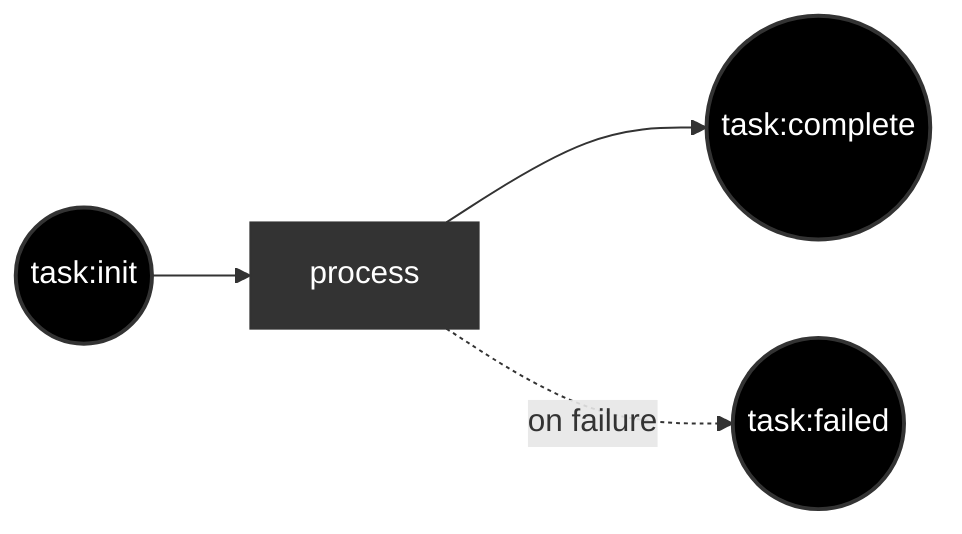
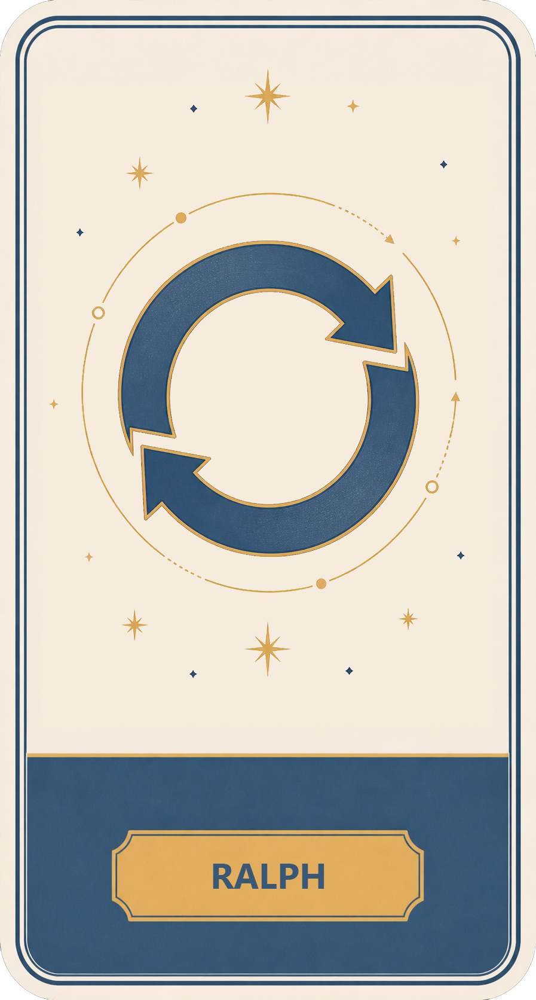
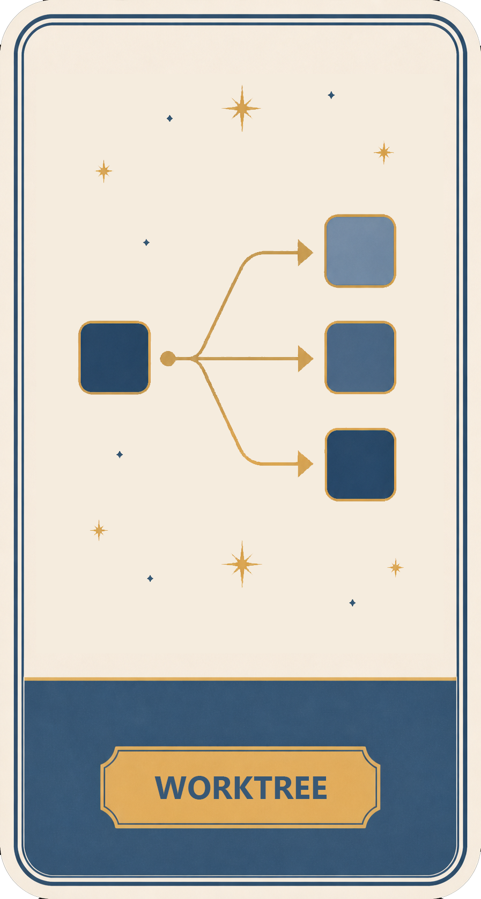

# Infinite You

[](https://github.com/portpowered/infinite-you/actions/workflows/ci.yml)
[](https://github.com/portpowered/infinite-you/releases)
[](https://go.dev/)
[](./LICENSE.md)

Infinite You is an AI agent factory. It orchestrates AI agents for you so you can do more work without doing everything manually.

## Why?

Leverage. 

With __Infinite You__, you codify your process into a workflow with different AGENTs.md and run them as wrappers around OpenAI codex.

For example: 
- dispatch 10 agents to run independently in separate work trees
- have one agent loop through a series of tasks, and then have a reviewer review the output and retrigger the loop if it failed
- tell the agents a series of plans, and run them in dependency order
- have a cron setup to autonomously look at git tasks or whatever and submit tasks that go through a write/review cycle loop

## Install


1. install [codex](https://developers.openai.com/codex/cli) `npm i -g @openai/codex`
2. install on macOS/Linux: `curl -fsSL https://github.com/portpowered/infinite-you/releases/latest/download/install.sh | sh`
3. install on Windows PowerShell: `irm https://github.com/portpowered/infinite-you/releases/latest/download/install.ps1 | iex`
4. go `cd your-project-directory`
5. run `infinite-you`
6. submit a work task on the website interface, like "go write a report on my codebase at TEST.md", 
7. wait till complete
8. finished


### claude variant
```
infinite-you init --executor claude --dir my-factory
infinite-you docs workstation
```


## Example
Here's an example of the factory for infinite-you dispatching roughly 5-10 agents. 


## How It Works


The default no-argument starter flow looks like below: you give it a task, it spawns a basic agent CLI run and does stuff. 


## Customization 

See [authoring-workflows](./docs/reference/authoring-workflows.md) for the full configuration guide.
Infinite you lets you customize your flow however you want. 

The overall system of how __infinite you__ works is relatively simple. 
1. You have work. 
2. Work goes to workstations where the work gets worked on by workers (agents, or just shell scripts)
3. When the workstations complete the, work is converted to other work.  
4. __Infinite you__ stops when no work remains.


## Shipped example factories

Drag the images from the examples/factories directory into the web interface's flow graph, and it'll load the factory for you. 

<table>
  <tr>
    <td align="center">
      <strong>Doc reviewer</strong><br />
      Write and review workflow.<br />
      
    </td>
    <td align="center">
      <strong>Infinite you</strong><br />
      Meta factory that runs the factory.<br />
      
    </td>
    <td align="center">
      <strong>Ralph</strong><br />
      Iterative plan, code, and review loop.<br />
      
    </td>
  </tr>
  <tr>
    <td align="center">
      <strong>Timer</strong><br />
      Cron-based factory trigger.<br />
      
    </td>
    <td align="center">
      <strong>Worktree</strong><br />
      Spawns work in a git worktree.<br />
      
    </td>
    <td align="center">
      <strong>Writer reviewer</strong><br />
      Iterative loop for writing docs.<br />
      
    </td>
  </tr>
</table>

### References

- [Analysis on current projects](docs/comparatives/comparing-systems.md)
