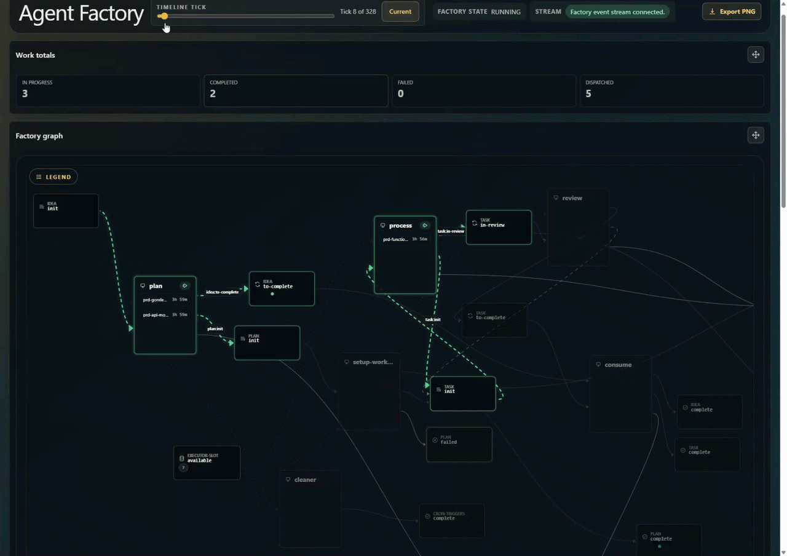
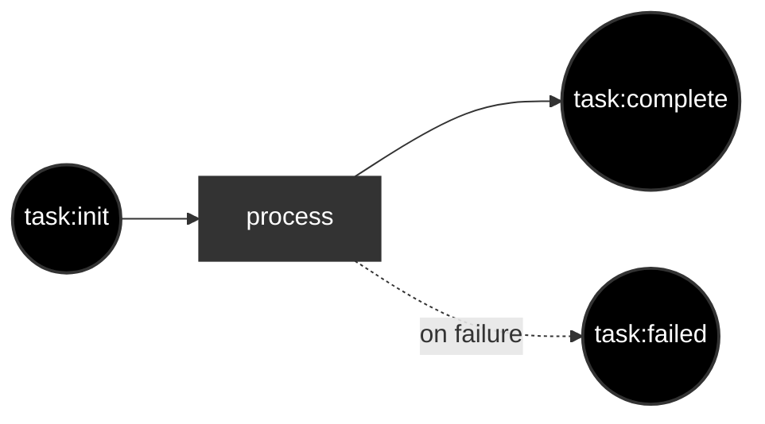

# Infinite You

[](https://github.com/portpowered/infinite-you/actions/workflows/ci.yml)
[](https://github.com/portpowered/infinite-you/releases)
[](https://go.dev/)
[](./LICENSE.md)

Infinite You is an AI agent factory. It orchestrates AI agents for you so you can do more work without doing everything manually.

## Why?

Leverage. 

With __Infinite You__, you codify your process into a workflow with different AGENTs.md and run them as wrappers around OpenAI codex.

For example: 
- dispatch 10 agents to run independently in separate work trees
- have one agent loop through a series of tasks, and then have a reviewer review the output and retrigger the loop if it failed
- tell the agents a series of plans, and run them in dependency order
- have a cron setup to autonomously look at git tasks or whatever and submit tasks that go through a write/review cycle loop

## Install


1. install [codex](https://developers.openai.com/codex/cli) `npm i -g @openai/codex`
2. install on macOS/Linux: `curl -fsSL https://github.com/portpowered/infinite-you/releases/latest/download/install.sh | sh`
3. install on Windows PowerShell: `irm https://github.com/portpowered/infinite-you/releases/latest/download/install.ps1 | iex`
4. go `cd your-project-directory`
5. run `infinite-you`
6. submit a work task on the website interface, like "go write a report on my codebase at TEST.md", 
7. wait till complete
8. finished


### claude variant
```
infinite-you init --executor claude --dir my-factory
infinite-you docs workstation
```


## Example
Here's an example of the factory for infinite-you dispatching roughly 5-10 agents. 




## How It Works


The default no-argument starter flow looks like below: you give it a task, it spawns a basic agent CLI run and does stuff. 


## Customization 

See [authoring-workflows](./docs/reference/authoring-workflows.md) for the full configuration guide.
Infinite you lets you customize your flow however you want. 

The overall system of how __infinite you__ works is relatively simple. 
1. You have work. 
2. Work goes to workstations where the work gets worked on by workers (agents, or just shell scripts)
3. When the workstations complete the, work is converted to other work.  
4. __Infinite you__ stops when no work remains.


## Shipped example factories

### [examples/basic/factory](./examples/basic/factory/README.md)

Single-step task workflow.

### [infinite-you's factory](./factory/factory.json)

This is the factory that we use to boostrap. You can see all the PRs on this project run on this. 

This is a fairly complex, but at a high level, you give it an input, it turns it into a plan, dispatches it into a worktree, runs a pr. 

### [write-code-review](./examples/write-code-review/README.md) 

given an input, it writes the code, and does a review. 

### [thought idea plan work review](./examples/thought-idea--plan-work-review/README.md)

Multi-stage idea, planning, and review workflow.

This does given a thought you write out, it generates a plan, writes a iterative worker that runs through all the work items and dispatches them, and reviews

## Alternatives

Generally, the impetus for writing this is i wanted a lightweight orchestrator that could be used for whatever workflow i wanted. 
To that end, the existing systems were too heavy, or too opinionated on their flows. 

With __infinite you__, you just run a binary, you can check in the workflow/AGENT files and that's it.


| Program          | Recursion, FanIn, Stateful | Custom workflows | Agent harness support   | Just a file   | Durable workflows | Relatively stable |
| ---------------- |:--------------------------:|:----------------:|:-----------------------:|:-------------:|:-----------------:|------------------:|
| Infinite you     |             X              |           X      |           x             |      x        |                   |         X         |
| Random Scripts   |             X              |           X      |           x             |      x        |                   |                   |
| Gas Town         |             X              |                  |           x             |               |                   |         X         |
| DBOS             |             X              |           X      |                         |               |         X         |         X         |
| Dagster          |                            |           X      |                         |               |                   |         X         |
| N8N              |             X              |           X      |                         |               |                   |         X         |
| Temporal         |             X              |           X      |                         |               |         X         |         X         |

### Custom scripts

You can just write custom scripts with python, bash/powershell:
- ralph loop
- auto researcher

I did the same thing, but needed to run the system on my windows and mac laptop and also the thing kept failing as i added more complex stuff to it. 

### [Gas town](https://github.com/gastownhall/gastown)

This is an alternative agent orchestration framework. It works quite well but its rather opinionated on how it does stuff 
- reliance on doltDB,beads
- rigid workflow structure. 
- git 

With __infinite you__, there's no fixed structure so you can do whatever you want with it. i.e. if you want the system to not submit anything and just spawn thirty QA bots reviewers to ensure the code conforms to your standards and is passing all the tests you can do that. 

### Dagster
This is a standard workflow engine, it works okay, but there's no affordances for agent harnesses so you have to write one yourself. 
Also its a directed acyclic graph, but work processes are never really DAGs, they're more like spaghetti. In the end I couldn't figure out how to make it do a standard execute (loop) -> review loop. 

### DBOS
This is a complex durable workflow engine. Its fairly lightweight relative to its alternatives. 

As a comparative, __infinite you__ doesn't have mechanisms for transactional consistency or durability of execution. 

But its still too heavy, since i didn't want to write code. The code vs config thing is a tradeoff, code's too hard to grok quickly frankly, config is verbose but any config with verbosity theoretically induces itself to levels of complexity wherein you end up mapping to code anyways. Unless you're SQL or something. 


### Temporal 
This is also a complex durable workflow engine. 
This is flexible enough to do what I wanted. 
This thing is just way too heavy for the use case of just having an AGENT run, relative to DBOS and alternatives. 

### N8N
This is a robotic process automation tool. It has theoretically what i want, but it generally confused me. Its too heavy. I couldn't really get it to do what i want. 
