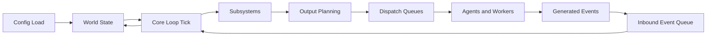
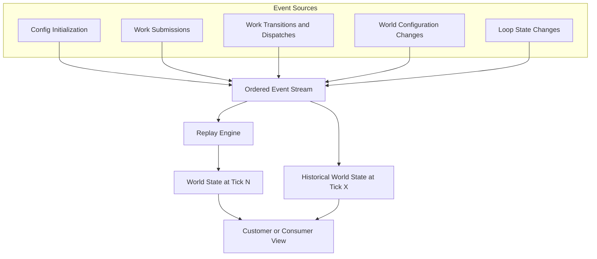
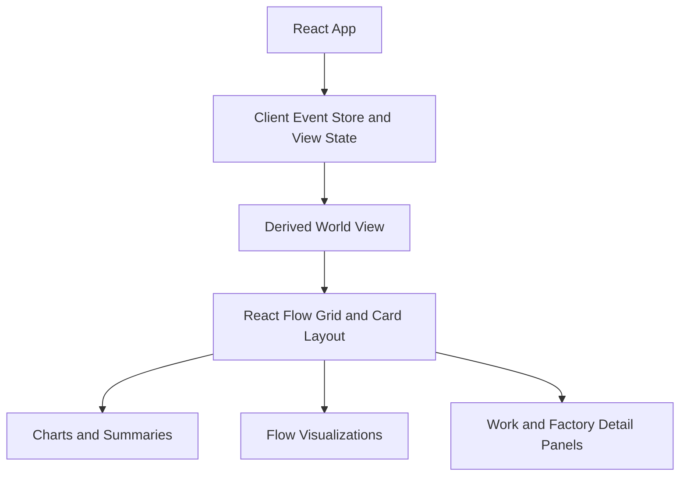
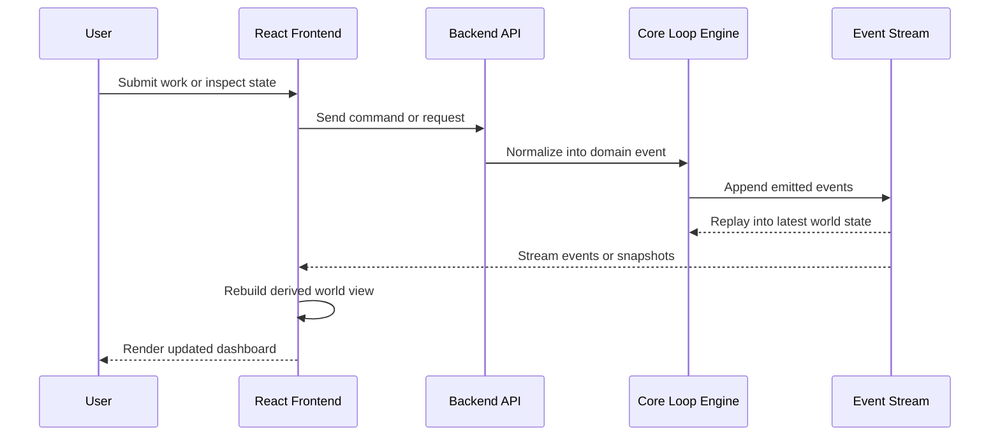

# Backend

## Core Loop

The backend centers on a deterministic tick loop that updates a shared world state from submitted events. Each tick reads pending inputs, applies subsystem logic, and emits outputs that are handed off to queues and workers.

The loop is intentionally closed: workers and agents do not mutate the world directly. They produce outputs that re-enter the system as events, which keeps the state transition history explicit and replayable.

## Event Stream

The world is derived from an ordered event stream rather than a collection of opaque mutable objects. This stream is the durable source of truth for replay, synchronization, and historical inspection.

At any tick, the current world is the composition of all prior events. Because the stream is deterministic, customers can receive the same event history and reconstruct a consistent view at any chosen timestamp or tick.

# Front End

The frontend is an embedded React application that consumes the backend event stream and derives a customer-facing world view from it. The UI emphasizes composable dashboards and visualizations rather than owning the authoritative system state.

## Frontend Composition

The React layer receives events, derives projections for the current world, and renders that state through cards, charts, and flow-oriented views.

## Frontend and Backend Integration

The frontend and backend are connected by an event-oriented contract. The backend owns execution, scheduling, and replayable history; the frontend subscribes to that history, derives projections, and sends user actions back as submissions.

This split keeps the frontend lightweight and keeps the backend authoritative. The same event stream that powers execution can also power dashboards, audit history, and deterministic replay.
