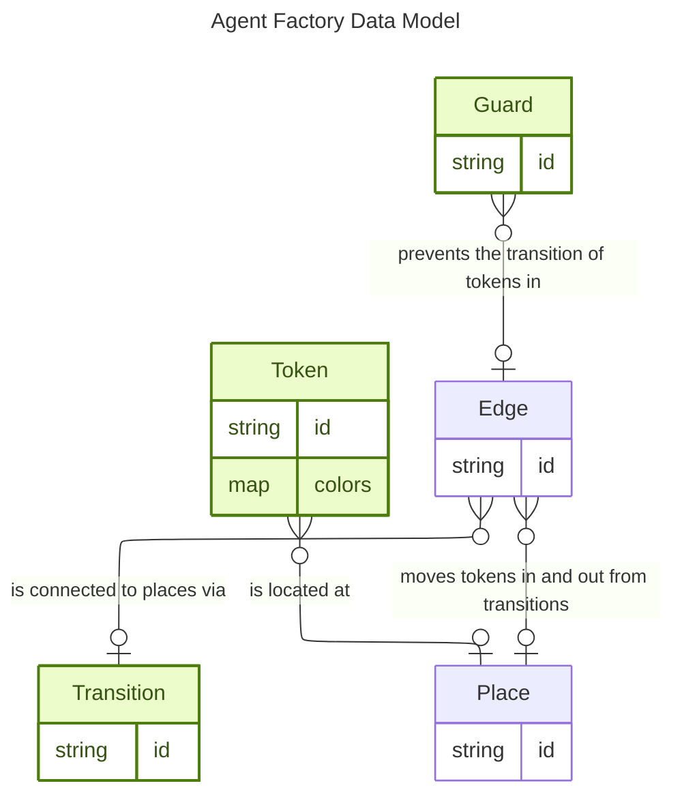
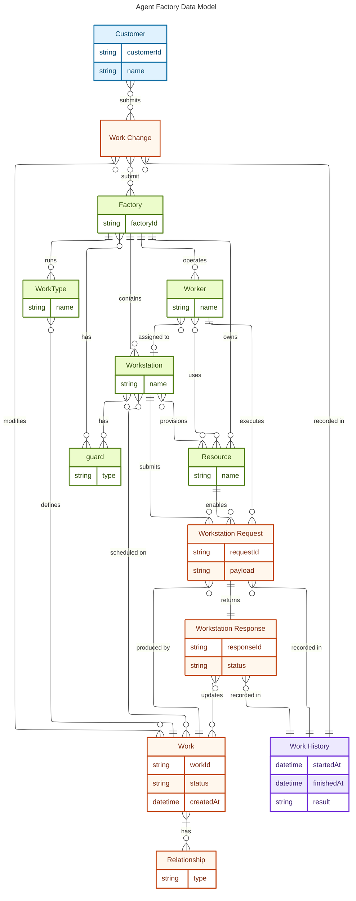

# Data model

This document captures the Agent Factory data model and separates entities into two layers:
- Customer-facing surface
- Factory internals

The data model has a customer facing data model and an internal data model. 

The internal data model is what is defined in business processes a "petri net with colored tokens and guarded transitions" 
The factory customer data model is an abstraction over that petri net that makes customers lives easier to deal with. The raw tokens/transitions ends up far too verbose to express reasonably. 

## Internal system data model

## Customer data model 

This denotes the data model that we express to customers. Customers deal with work that goes into a factory. The factory has workstations that take in work. The factory/workstations have guards that protect the individual work. 

