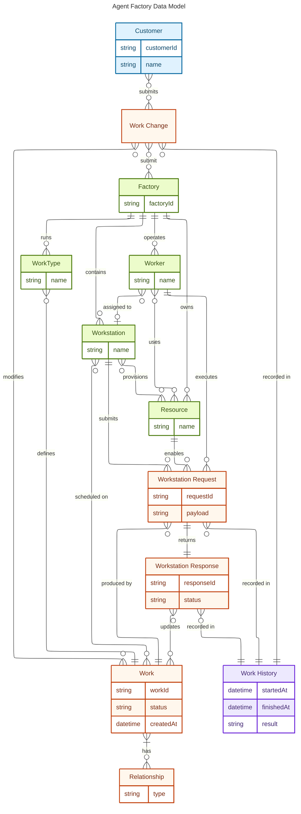

# Data model

This document captures the Agent Factory data model and separates entities into three layers:
- Customer-facing surface
- Factory internals
- Work history/auditing layer

## Segmented data model

