# High Level

Related development docs:

- [Record/Replay Design](./record-replay-design.md)
- [Package Dependency Graph](./package-dependency-graph.md)

Overall, each factory tries to map the factory's workflows into what we call a petri net. 

In the factory, you have a way of saying that there's these pieces of work, workstations that transform work, and workflows that dictate the graph of how the work gets transformed. 

## Transformation

Factory.json (human representation) -> Petri net (computational representation)

However, the workflow mapping is hard for us to compute mathematically/algorithmically. 
We convert internally, the factory presentation to a thing we call a petri net. 
In the petri net, each type of state of a piece of work is called a place. Then the work station is called a transition. 
We then put tokens in different places on the graph as new work gets submitted. 

## Example transformation

This shows what the original factory looks like, and how we map the transition. 

### 

{
    "work-types": [
        {
            "type": "story",
            "states": [
                {
                    "name": "started",
                    "type": "INITIALIZATION"
                },
                {
                    "name": "completed",
                    "type": "COMPLETED"
                }
            ]
        }
    ],
    "resources": [
        {
            "name": "agents"
        }
    ],
    "workers": [
        {
            "name": "claude"
        }
    ],
    "workstations": [
        {
            "name": "programmer",
            "worker": "claude",
            "inputs": [
                {
                    "type": "story",
                    "state": "started"
                }
            ],
            "outputs": [
                {
                    "type": "story",
                    "state": "completed"
                }
            ],
            "requiredResource": [
                {
                    "type": agents
                }
            ]
        }
    ]
    }
}

### Corresponding petri net

In the petri net, the places are (story: started, story: completed, and the agents). The transition is the workstation. 

```mermaid

flowchart LR
   classDef agent fill:#000,stroke:#333,stroke-width:2px
   classDef story fill:#888888,stroke:#333,stroke-width:2px
   classDef transition fill:#333,stroke:#333,color:#fff,rx:0,ry:0

   P0((story:started)):::story
   P1((story:completed)):::story

   P3((agent)):::agent

   T0[programmer]:::transition

   P0 --in ---> T0
   P3 --in ---> T0

   T0 -- out ---> P1
   T0 -- out ---> P3
```

Basically, we model the resources as places to. We consume them, and then release them when there's none left. 
We model it this way, because its easier to reason about. 
