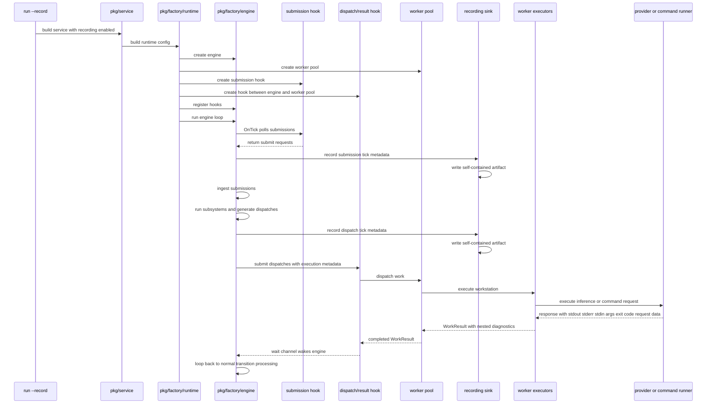
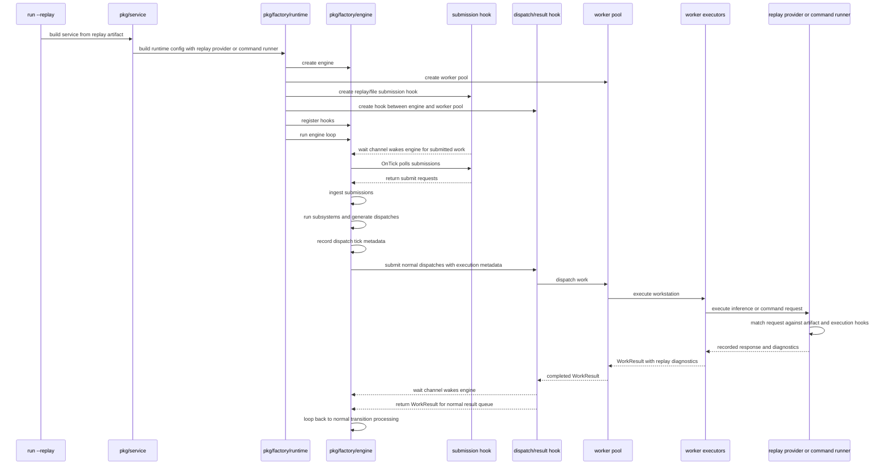

# Agent Factory Record/Replay Design

---
author: Codex
last modified: 2026, april, 10
component: agent-factory
doc-id: AGF-DEV-003
---

This document proposes a deterministic record/replay system for `agent-factory run`. It is for maintainers working on the factory runtime, worker execution pipeline, and test harnesses.

## Problem

Customers can hit runtime failures that are difficult to reproduce locally because the current factory runtime depends on concurrent worker execution, provider behavior, script execution, and wall-clock timing. We can inspect traces after the fact, but we cannot feed a failed run back into the system and replay the same execution mechanically.

If we do nothing, we will keep debugging failures from partial logs and intuition instead of from a deterministic reproduction artifact. That slows incident response, makes regressions harder to pin down, and prevents us from building a durable failure queue that can be replayed in tests.

## Goals

- Add `agent-factory run --record <path>` to capture a self-contained replay artifact from a customer run.
- Add `agent-factory run --replay <path>` to deterministically replay recorded dispatch and completion behavior.
- Reproduce factory behavior at the level that matters for routing, retries, throttling, and failure handling.
- Preserve enough nested execution detail to debug provider-level and script-level failures without requiring a live provider call.
- Make recorded failures promotable into automated regression tests.

## Non-Goals

- Perfectly replay external systems at the HTTP packet level.
- Preserve exact goroutine scheduling or host OS scheduling behavior.
- Introduce durable runtime persistence for the full factory state outside the replay artifact.
- Replace the current trace and dashboard read models.

## Constraints

- The existing engine is tick-based and uses ticks, not durations, to decide when factory state advances.
- The current runtime uses asynchronous worker execution in [`factory.go`](/c:/Users/user/work/portos/portos-backend/libraries/agent-factory/pkg/factory/runtime/factory.go) and [`runner.go`](/c:/Users/user/work/portos/portos-backend/libraries/agent-factory/pkg/workers/runner.go).
- Several runtime paths still use wall clock time directly, including dispatch timestamps and provider throttle pauses in [`subsystem_dispatcher.go`](/c:/Users/user/work/portos/portos-backend/libraries/agent-factory/pkg/factory/subsystems/subsystem_dispatcher.go).
- Replay artifacts must not depend on the customer still having the same local `factory.json`, `AGENTS.md`, or input files available.
- The design should fit the current package layering documented in [package-dependency-graph.md](./package-dependency-graph.md).
- Replay correctness depends on deterministic ordering when multiple transitions, resource tokens, or ordinary work tokens are simultaneously eligible during the same tick.
- Tests should stay as close as possible to production runtime behavior and prefer the existing full worker-pool path over test-only bypasses.

## Design Principles

- Replay logical behavior, not incidental latency.
- Record at the factory boundary that determines routing correctness.
- Preserve lower-level diagnostics as optional nested data rather than making them the replay contract.
- Make the replay artifact self-contained and versioned.
- Keep the production runtime path close to the replay path so failures stay meaningful.

## Options

### Option 1: Record only provider/script I/O

Record the inferencer requests, command runner invocations, stdout/stderr, and provider responses. Rebuild the factory run by re-executing the upper layers while stubbing only the deepest side-effect boundary.

Pros:

- Very rich debugging data for worker internals.
- Good for provider and script executor debugging.
- Minimal changes to the engine and dispatcher contracts.

Cons:

- Does not directly control when results are delivered back into the factory tick loop.
- Still leaves determinism gaps around concurrency, result arrival ordering, and wall-clock behavior.
- Reconstructing the exact factory-level failure depends on faithfully re-running more code.

### Option 2: Record only factory dispatch/result behavior

Record each `WorkDispatch` emitted by the dispatcher and each `WorkResult` observed by the engine, including the ticks at which they were created and delivered. Replay bypasses real workers entirely and injects recorded results at recorded ticks.

Pros:

- Best determinism for token routing, retries, review loops, and circuit-breaker behavior.
- Aligns directly with the engine's current runtime model.
- Simpler replay runner than provider-level reconstruction.

Cons:

- Lower-level provider or script debugging data is lost unless separately logged.
- Bugs caused inside prompt rendering or executor setup are only visible through the resulting `WorkResult`, not the substeps.

### Option 3: Dual-layer recording

Record the authoritative replay contract at the factory dispatch/result boundary and also attach optional nested diagnostics captured from the inferencer, command runner, and worker executor layers.

Pros:

- Deterministic replay for factory behavior.
- Deep debugging detail for provider, script, and prompt failures.
- Lets us answer both questions:
1. "Can we reproduce the failure mechanically?"
2. "Why did the worker produce this result?"

Cons:

- Larger artifact size.
- More plumbing across runtime and worker packages.
- Requires clear ownership so the replay contract does not drift into an oversized generic event log.

## Decision

Choose Option 3.

The replay system should use factory-level dispatch/result events as the only behavioral source of truth during replay, while also capturing optional nested executor diagnostics for analysis. This satisfies the determinism requirement without throwing away the data needed to debug model-provider and script-worker failures.

## Proposed Architecture

### Time Model

The system will use two time domains:

- Logical time: tick numbers used for replay behavior.
- Physical time: wall-clock timestamps and durations used only for observability and debugging.

Replay uses logical time as authoritative. Physical durations are informational and must not determine when a replayed result is delivered.

### Deterministic Ordering Model

Replay requires the factory to make stable choices when several actions are simultaneously valid in one tick. The runtime should therefore define and test deterministic ordering for:

- enabled transitions before scheduling
- resource-token selection when multiple resource tokens satisfy the same arc
- ordinary work-token selection when multiple candidate tokens satisfy the same input place

The intent is not to change the business meaning of the workflow. The intent is to make equivalent runtime states produce the same dispatch order every time.

The preferred approach is to sort using stable intrinsic identifiers already present in the runtime model:

- transitions by transition ID
- tokens by token ID
- resources by token ID or another stable resource-token identity if resource token IDs are not durable enough

Any scheduler that intentionally changes priority should still start from a deterministic base ordering before applying its policy.

### Replay Artifact

A replay artifact is a versioned JSON file that contains:

- Artifact metadata and schema version.
- A normalized snapshot of the effective factory definition.
- Resolved worker and workstation runtime definitions.
- Initial and runtime submissions that entered the engine.
- Dispatch records stamped with creation tick.
- Completion records stamped with delivery tick.
- Optional nested diagnostics from provider/script execution.
- Optional wall-clock metadata for human analysis.

Proposed top-level shape:

```json
{
  "schema_version": 1,
  "recorded_at": "2026-04-10T18:00:00Z",
  "factory_definition": {},
  "runtime_config": {
    "workers": {},
    "workstations": {}
  },
  "submissions": [],
  "dispatches": [],
  "completions": [],
  "diagnostics": []
}
```

### Deterministic Replay Contract

The replay contract is:

- Submission `S` is submitted at recorded tick `Ts`.
- Dispatch `D` is expected to be emitted by the factory at recorded tick `Td`.
- Completion `C` for `D` is returned through the normal worker result path at recorded tick `Tc`.
- Worker-pool and worker-executor code must observe the same logical engine tick as the engine, not infer its own independent time.

Replay should fail fast when the factory diverges materially from the recording, for example:

- Expected dispatch is missing.
- Transition ID differs.
- Consumed token identity or lineage differs beyond tolerated normalization.
- A completion is due for a dispatch the runtime did not create.

That divergence signal is one of the key debugging outputs of replay mode.

### Capture Layering

The design records at two layers.

Primary layer:

- `workers.WorkDispatch`
- `workers.WorkResult`
- engine tick metadata

Secondary diagnostic layer:

- rendered prompt metadata
- provider request/response metadata
- script command, arguments, env projection, stdout, stderr, exit code
- timeout and panic recovery details

The recording sink should not communicate directly with worker executors. Instead, nested diagnostics must be captured by the execution path and propagated back as part of `WorkResult`. The engine records the completed `WorkResult` and its diagnostics after it becomes visible to the runtime.

Nested diagnostics should include, where applicable:

- captured provider or command request input
- rendered stdin
- command arguments
- command environment projection
- stdout
- stderr
- exit code
- provider response metadata
- timeout and panic details

The secondary layer is not a separate replay driver. It explains why a recorded `WorkResult` happened and gives the replay provider or replay command runner enough request metadata to match and return the recorded behavior.

### Execution Metadata Propagation

The dispatch/execution request contracts should carry engine timing and replay matching metadata all the way from dispatcher to worker pool to workstation executor to inference provider or command runner.

At minimum, `workers.WorkDispatch` should grow an execution metadata field similar to:

```go
type ExecutionMetadata struct {
    DispatchCreatedTick int
    CurrentEngineTick   int
    TraceID             string
    WorkIDs             []string
    ReplayKey           string
}
```

The same metadata should be propagated into model-provider and command-runner request structs. Concretely, the metadata should flow into `workers.InferenceRequest` and `workers.CommandRequest` so the provider-facing inference dispatch path can pass the current tick, dispatch-created tick, trace/work identity, and replay key to the replay-aware provider or command runner. This makes replay matching explicit at the lower side-effect boundary, where replay actually substitutes behavior.

Replay mode should not require a replay session to know about the engine directly. Instead:

- the engine emits normal dispatches with execution metadata
- the worker pool executes normal workstation executors
- model workers call a replay-aware provider implementation when configured for replay
- script workers call a replay-aware command runner when configured for replay
- the replay provider/command runner matches the request against the artifact and returns the recorded response plus diagnostics
- the workstation executor converts that response into a normal `WorkResult`
- the worker pool returns that result through the same runtime result path as production

This preserves the production execution shape and keeps replay behind the worker/provider abstraction rather than coupling replay to engine internals.

### Runtime Clock/State Sharing

The worker pool, worker runners, and worker executors need a harnessed view of the current engine state. Without that shared view, a worker can only respond based on wall-clock completion or goroutine scheduling, which is exactly the non-determinism replay is trying to remove.

The runtime should use the existing engine-state snapshot shape as the common parameter passed to tick hooks and worker/replay bridge code. This avoids custom bespoke hook event structs and keeps every hook listening to the same runtime vocabulary.

The shared state view should include:

- current engine tick
- current runtime status
- in-flight dispatch IDs
- safe snapshot access for diagnostics
- result submission callback used by worker runners

This view should be read-only except for the explicit result-submission path. Workers should not mutate engine state directly. The purpose is to let worker execution and replay understand "the engine is currently at tick A" and route a recorded result back to the submit/result queue at the correct logical time.

For production execution, the worker runner records the engine tick at dispatch creation and records the engine tick when the result becomes visible to the engine. For replay execution, the replay-aware provider or command runner uses propagated execution metadata to match the request against the artifact and return the recorded provider/command response. The normal workstation executor and worker pool then produce and publish a normal `WorkResult`.

### Tick Hook Contract

Tick hooks should be engine input sources. They should not be a general plugin system and should not mutate marking state directly.

The hook interface should pass the engine state snapshot directly:

```go
type TickHook interface {
    Name() string
    Priority() int
    OnTick(ctx context.Context, snapshot state.EngineStateSnapshot) (TickHookResult, error)
    WaitCh(ctx context.Context, snapshot state.EngineStateSnapshot) <-chan struct{}
}

type TickHookResult struct {
    SubmitRequests []factory.SubmitRequest
    WorkResults    []workers.WorkResult
    Continue       bool
}
```

`OnTick` answers "what is due now for this engine state?" and `WaitCh(ctx, state)` answers "for this engine state, what channel should wake the engine when this hook has something that may be due?" Passing the same engine snapshot to both methods keeps hook behavior tied to the runtime state instead of to hidden internal hook state alone.

For the first implementation, hook wait channels should be buffered and awaited directly by the engine. We should not build fragile non-blocking/coalesced wake semantics into the contract. If buffered awaited channels become difficult to reason about under load, the fallback design is a sampled game-loop mode where the engine continuously ticks at configured sample intervals.

## Runtime Flow



## Replay Flow



## Tick Semantics

We will model result timing by delivery tick, not elapsed duration.

Example:

- Dispatch `executor-A` created at tick 12.
- The customer run observed the result at tick 15.
- Replay returns the recorded provider/command response so the normal worker path produces the same `WorkResult` at tick 15.

This matches the current engine contract better than replaying "result after 847 milliseconds", because the engine only changes behavior when a tick observes pending results.

Worker execution must therefore be coupled to the engine's logical tick source. A dispatch created at tick `A` can carry its creation tick, and the worker-pool/provider/command-runner path can decide that the corresponding result should be published back into the engine result queue at tick `C`. In record mode, tick `C` is the tick where the engine actually observes the result. In replay mode, tick `C` is represented in the artifact and enforced by the replay-aware provider or command runner response behavior.

The tick loop should follow this order:

1. Wake from a buffered hook channel, normal submit signal, worker-result signal, or context cancellation.
2. Start tick `N`.
3. Build the current `state.EngineStateSnapshot`.
4. Call `OnTick(ctx, snapshot)` on registered hooks in deterministic priority/name order.
5. Record and ingest submit requests returned by submission hooks.
6. Ingest work results returned by dispatch/result hooks.
7. Run the normal subsystem pipeline.
8. Record generated dispatches in the engine.
9. Submit generated dispatches to dispatch/result hooks.
10. Continue ticking while hook outputs, subsystem mutations, pending results, or pending submissions indicate immediate progress.
11. If no immediate progress remains, await the buffered wait channels again.

## Deterministic Dispatch Preconditions

Before record/replay is considered complete, dispatch and transition processing should be deterministic under equal input state. Concretely, we need tests that prove:

- the same set of enabled transitions yields the same ordered dispatch sequence
- the same set of eligible work tokens yields the same consumed-token ordering
- the same set of eligible resource tokens yields the same resource-consumption ordering

This work belongs near the scheduler and dispatcher path, especially around [`subsystem_dispatcher.go`](/c:/Users/user/work/portos/portos-backend/libraries/agent-factory/pkg/factory/subsystems/subsystem_dispatcher.go), the scheduler package, and any token-collection logic used before dispatch.

## Factory Definition Strategy

The replay artifact must embed the effective factory definition.

It should include:

- normalized `factory.json`
- resolved runtime worker definitions
- resolved runtime workstation definitions
- recording metadata such as workflow ID, source directory, and configuration hashes

Replay should build from the embedded configuration by default. It may optionally support "replay against current local config" later, but that is not part of the first version because it weakens determinism.

## Clock Strategy

To make replay deterministic, runtime time access should be injected behind a shared clock interface instead of calling `time.Now()` directly inside engine and subsystem code.

Initial clock modes:

- Real clock: used in normal runs.
- Replay clock: advances deterministically from the artifact, normally one step per tick.

The first implementation does not need to reproduce exact recorded nanoseconds everywhere. It does need to make time-dependent logic deterministic, especially throttle pauses and dispatch timestamps.

## Package Ownership Map

### `libraries/agent-factory/pkg/cli`

Responsibilities:

- Add `--record` and `--replay` flags to the `run` command.
- Validate incompatible combinations such as mock-worker execution with `--replay` if we decide they conflict.

Expected changes:

- extend [`root.go`](/c:/Users/user/work/portos/portos-backend/libraries/agent-factory/pkg/cli/root.go)

### `libraries/agent-factory/pkg/cli/run`

Responsibilities:

- Extend `RunConfig` with record/replay options.
- Pass record/replay configuration into the service layer.

Expected changes:

- extend [`run.go`](/c:/Users/user/work/portos/portos-backend/libraries/agent-factory/pkg/cli/run/run.go)

### `libraries/agent-factory/pkg/cli/dashboard`

Responsibilities:

- Own CLI dashboard rendering and dashboard-specific read models.
- Keep session summary and trace projection structs out of the engine state package.

Expected changes:

- extend [`dashboard.go`](/c:/Users/user/work/portos/portos-backend/libraries/agent-factory/pkg/cli/dashboard/dashboard.go)
- extend [`dispatch_lineage.go`](/c:/Users/user/work/portos/portos-backend/libraries/agent-factory/pkg/cli/dashboard/dispatch_lineage.go)
- extend [`session_summary.go`](/c:/Users/user/work/portos/portos-backend/libraries/agent-factory/pkg/cli/dashboard/session_summary.go)

### `libraries/agent-factory/pkg/service`

Responsibilities:

- Build the runtime either from the live filesystem config or from an embedded replay artifact config.
- Wire recorder dependencies and replay-aware worker side-effect dependencies into the runtime factory options.
- Own artifact loading and top-level mode validation.
- In replay mode, configure workers with replay-aware provider and command-runner implementations rather than wiring replay directly into the engine.

Expected changes:

- extend [`factory.go`](/c:/Users/user/work/portos/portos-backend/libraries/agent-factory/pkg/service/factory.go)
- extend [`runtime_config.go`](/c:/Users/user/work/portos/portos-backend/libraries/agent-factory/pkg/config/runtime_config.go)
- add a replay artifact loader in `pkg/service` or a dedicated `pkg/replay`

### `libraries/agent-factory/pkg/factory`

Responsibilities:

- Define new runtime options for recorder, replay artifact access, replay-aware worker side effects, and injected clock.
- Keep public contracts small and explicit.
- Define the tick hook and hook-result contracts if they need to be public factory-level extension points.
- Prefer `state.EngineStateSnapshot` as the hook input parameter instead of custom one-off tick event structs.

Expected changes:

- extend [`options.go`](/c:/Users/user/work/portos/portos-backend/libraries/agent-factory/pkg/factory/options.go)
- possibly add a small replay-facing interface in `pkg/factory`

### `libraries/agent-factory/pkg/factory/engine`

Responsibilities:

- Stamp submissions, dispatch creation, and completion observation with tick metadata.
- Expose the hooks needed by the recorder and replay-aware worker side-effect implementations.
- Use injected clock instead of direct wall-clock calls where practical.
- Publish the current logical tick and runtime snapshot through the shared runtime view.
- Own the normal result ingestion path, but receive worker completions through registered tick hooks instead of talking directly to the worker pool.
- Invoke tick hooks with `state.EngineStateSnapshot` at the beginning of each active tick.
- Await buffered hook wait channels when the engine has no immediate progress to make.
- Attach execution metadata, including current tick and dispatch-created tick, to normal worker dispatches.
- Receive work submissions from submission hooks and record submission tick metadata before ingesting them.
- Record dispatch tick metadata in the engine before handing dispatches to dispatch/result hooks.
- Submit generated dispatches to dispatch hooks rather than directly to worker pools.

Expected changes:

- extend [`engine.go`](/c:/Users/user/work/portos/portos-backend/libraries/agent-factory/pkg/factory/engine/engine.go)
- extend [`runtime_state.go`](/c:/Users/user/work/portos/portos-backend/libraries/agent-factory/pkg/factory/engine/runtime_state.go)

### `libraries/agent-factory/pkg/factory/subsystems`

Responsibilities:

- Use injected clock for dispatcher time-dependent behavior.
- Optionally expose deterministic replay checkpoints around dispatch/result handling.
- Normalize dispatch ordering across transitions, resources, and tokens before dispatch records are emitted.

Expected changes:

- extend [`subsystem_dispatcher.go`](/c:/Users/user/work/portos/portos-backend/libraries/agent-factory/pkg/factory/subsystems/subsystem_dispatcher.go)

### `libraries/agent-factory/pkg/workers`

Responsibilities:

- Wrap worker executors with recording hooks at the `WorkDispatch -> WorkResult` boundary.
- Capture optional nested diagnostics from inferencer and command runner layers.
- Provide replay-aware provider and command-runner implementations that satisfy the normal worker side-effect interfaces.
- Accept the shared engine runtime view so worker runners can stamp dispatch/result timing with engine ticks instead of local wall-clock-only state.
- Propagate execution metadata from `WorkDispatch` into provider and command-runner request models.
- Return nested diagnostics on `WorkResult` so the recording sink does not need to talk to worker executors directly.
- Keep worker pool concerns behind dispatch/result hooks so the engine does not own worker-pool channels directly.

Expected changes:

- extend [`interfaces.go`](/c:/Users/user/work/portos/portos-backend/libraries/agent-factory/pkg/workers/interfaces.go)
- extend [`workstation_executor.go`](/c:/Users/user/work/portos/portos-backend/libraries/agent-factory/pkg/workers/workstation_executor.go)
- extend [`inference_provider.go`](/c:/Users/user/work/portos/portos-backend/libraries/agent-factory/pkg/workers/inference_provider.go)
- extend [`runner.go`](/c:/Users/user/work/portos/portos-backend/libraries/agent-factory/pkg/workers/runner.go)
- extend [`pool.go`](/c:/Users/user/work/portos/portos-backend/libraries/agent-factory/pkg/workers/pool.go)
- optionally extend provider/script implementations for nested diagnostics

### New package: `libraries/agent-factory/pkg/replay`

Responsibilities:

- Define the replay artifact schema and versioning.
- Own serialization and deserialization.
- Implement recorder behavior and replay matching helpers used by replay-aware provider and command-runner implementations.
- Implement divergence detection and replay reports.

Why a new package:

- Keeps replay concerns from leaking into `pkg/service` and `pkg/workers`.
- Avoids turning the engine package into an artifact-format owner.
- Fits the existing layering better than scattering artifact types across unrelated packages.

Possible files:

- `artifact.go`
- `recording_session.go`
- `replay_matcher.go`
- `replay_provider.go`
- `replay_command_runner.go`
- `clock.go`
- `report.go`

### New or Existing package: submission hooks

Responsibilities:

- Bridge external or replayed work submissions into the engine.
- Own the buffered wait channel that wakes the engine when submit requests are available.
- Drain pending submit requests during `OnTick(ctx, state)` and return them to the engine.
- Avoid recording submission metadata directly; the engine records submissions after receiving them from hooks so all submission sources share one recording path.

Examples:

- API/filewatcher/direct submit hook
- replay submission hook

### New or Existing package: dispatch/result hooks

Responsibilities:

- Bridge engine dispatches to the worker pool.
- Accept engine-recorded dispatches and submit them to the worker pool.
- Own the buffered wait channel that wakes the engine when pool results are available.
- Drain completed pool results during `OnTick(ctx, state)` and return them as normal `WorkResults`.
- Record completion tick metadata and `WorkResult` diagnostics before returning results to the engine.

This hook is the only runtime bridge between the engine and worker pool. Runtime creates and wires the engine, worker pool, submission hooks, and dispatch/result hook, but it should not sit in the middle of submission or dispatch/result traffic after startup.

### `libraries/agent-factory/pkg/testutil`

Responsibilities:

- Load replay artifacts into regression harnesses.
- Provide helpers for asserting replay success or intentional divergence.
- Keep replay validation on the real worker-pool and script-wrap path whenever practical, especially through `WithFullWorkerPoolAndScriptWrap()`.

### `libraries/agent-factory/tests/functional_test`

Responsibilities:

- Prove deterministic ordering for transitions, resource tokens, and work tokens.
- Exercise record/replay behavior through the production-style harness configuration.
- Prefer [`WithFullWorkerPoolAndScriptWrap()`](/c:/Users/user/work/portos/portos-backend/libraries/agent-factory/pkg/testutil/testutil.go) plus provider or command-runner edge mocks instead of replay-specific execution shortcuts.

Expected coverage:

- repeated-run tests proving stable dispatch ordering under identical fixtures
- tests that validate resource-token consumption order when multiple resource tokens are available
- tests that validate work-token consumption order when multiple candidate tokens are present
- replay tests using the full worker pool and script-wrap provider path

### `libraries/agent-factory/tests/adhoc`

Responsibilities:

- Validate that the current adhoc run flow can be used to generate and consume replay artifacts.
- Keep a manual smoke path for `run --record` and `run --replay` using the existing adhoc fixture directory.

Expected coverage:

- extend [`main_adhoc_test.go`](/c:/Users/user/work/portos/portos-backend/libraries/agent-factory/tests/adhoc/main_adhoc_test.go) so a maintainer can manually invoke record and replay modes against the existing adhoc fixture
- ensure the adhoc factory fixture remains compatible with replay artifact generation

## Data Model Sketch

```json
{
  "dispatches": [
    {
      "dispatch_id": "d-1",
      "created_tick": 12,
      "transition_id": "executor",
      "worker_type": "executor-worker",
      "workstation_name": "executor",
      "input_tokens": []
    }
  ],
  "completions": [
    {
      "dispatch_id": "d-1",
      "delivered_tick": 15,
      "result": {
        "outcome": "FAILED",
        "error": "execution timeout",
        "diagnostics": {
          "stdin": "...",
          "args": ["agent-cli", "ask"],
          "stdout": "",
          "stderr": "timeout",
          "exit_code": 124,
          "request_input": {}
        }
      }
    }
  ]
}
```

## Contract Changes

### Worker pool and requester contract

The behavioral contract should shift from "workers finish whenever wall clock says they do" to "the runtime can observe and control when a result becomes visible to the engine".

In practice that means:

- submission hooks provide submit requests, but the engine records and ingests submissions
- dispatch creation and dispatch recording remain owned by the engine and dispatcher path
- result visibility becomes an explicit replayable event
- async worker execution remains valid in production, but the recorder stamps the observed delivery tick
- replay mode replaces provider and command-runner side effects with replay-aware implementations, not direct engine injection
- worker-pool and worker-executor code receive a shared logical runtime view through the dispatch/result hook so they can reason about current engine tick/state
- workers return results to the worker pool; the dispatch/result hook returns completed results to the engine during `OnTick`
- work dispatches and provider/command-runner requests carry execution metadata such as dispatch-created tick, current engine tick, trace ID, work IDs, and replay key
- work results carry nested diagnostics such as stdout, stderr, stdin, arguments, request input, response metadata, and exit code

### Submission contract

Submissions should also be recordable events, including:

- direct CLI work submission
- filewatcher preseed submissions
- filewatcher runtime submissions
- executor-spawned child work

This keeps replay complete even when work entered the system after startup.

## Failure Modes

### Replay divergence

Failure:

- the live runtime produces a different dispatch graph or provider/command request sequence than the recording

Detection:

- replay-aware provider and command-runner implementations validate request identity, transition identity, input lineage, execution metadata, and recorded response ordering

Recovery:

- stop replay and emit a divergence report instead of continuing with misleading results

### Clock drift inside runtime code

Failure:

- some code path still depends on `time.Now()` and makes replay non-deterministic

Detection:

- replay passes inconsistently or throttle behavior changes under replay

Recovery:

- move that code path to the injected clock

### Oversized artifacts

Failure:

- artifacts become too large due to nested diagnostics

Detection:

- artifact size metrics and slow test execution

Recovery:

- keep nested diagnostics optional and consider redaction or truncation policy per field

### Sensitive data capture

Failure:

- prompts, payloads, env vars, or stdout contain secrets

Detection:

- review of recorded artifact contents and redaction tests

Recovery:

- support recorder redaction rules before artifact persistence

## Rollback Strategy

If the implementation causes instability:

1. Disable `--record` and `--replay` flags at the CLI layer.
2. Leave the clock, runtime hooks, and replay-aware provider/command-runner implementations inactive when replay is not configured.
3. Keep the recorder and replay package isolated so reverting the feature does not require undoing unrelated engine or worker behavior.

The rollout should avoid replacing the default production execution path until replay mode is explicitly enabled.

## Implementation Plan

1. Introduce a new `pkg/replay` package with artifact types, schema versioning, and recorder interfaces.
2. Add deterministic ordering in the scheduler and dispatcher path for transitions, resource tokens, and ordinary work tokens before recording depends on those sequences.
3. Add tests that prove deterministic ordering under repeated identical runs.
4. Add `--record` and `--replay` to the CLI and service configuration path.
5. Add submission hooks that bridge external/replay submit requests into the engine while preserving engine-owned submission recording.
6. Add a dispatch/result hook that bridges engine-recorded dispatches to the worker pool and bridges completed worker results back to the engine through `OnTick`.
7. Add an injected clock abstraction and thread it through engine/runtime paths that currently rely on wall time.
8. Record submissions, dispatches, and completion observations with authoritative tick metadata in the engine/runtime path.
9. Wrap worker execution to capture optional nested diagnostics from workstation, provider, and script execution layers.
10. Implement replay mode that builds the runtime from the artifact's embedded factory definition and configures replay-aware provider and command-runner implementations to return recorded responses by execution metadata and tick.
11. Add divergence reporting so replay failures are explicit and actionable.
12. Add regression harness support in `pkg/testutil` using `WithFullWorkerPoolAndScriptWrap()` and convert at least one real failure reproduction into a replay-backed functional test.
13. Extend the adhoc test flow so maintainers can manually exercise record and replay against the current adhoc fixture.
14. Document customer and maintainer workflows for collecting and replaying artifacts.

## Testing Plan

- Unit tests for artifact serialization, versioning, and redaction.
- Engine-level tests for tick-stamped dispatch and completion recording.
- Worker-pool and hook tests proving runners observe the engine tick/state view and completed results return through the hook wait channel plus `OnTick` path.
- Functional tests that run the same fixture repeatedly and assert stable ordering for transitions, resources, and tokens.
- Functional tests should prefer `WithFullWorkerPoolAndScriptWrap()` and mock only at the outer edges such as provider command runner or provider response substitution.
- Replay tests that prove identical terminal token states for deterministic fixtures.
- Divergence tests where a changed workflow causes replay to fail with a clear report.
- End-to-end tests using `pkg/testutil` to promote a recorded failure into a regression artifact.
- Adhoc smoke tests that validate the existing adhoc fixture can generate a replay artifact and can run back through replay mode.

## Open Questions

- How strict should dispatch lineage matching be when token IDs are regenerated but work lineage is equivalent?
0) we want it to be matching as strictly as possible that we can have deterministic replay, but not strict enough that things are wrong. 

- Should replay mode allow running against the current checked-out code with the embedded config, or should it require an exact code-version match warning?
A) against current code, but we should have a mismatch check. 
- Which nested diagnostic fields need redaction by default?
B) don't redact anything for now
- Should `--record` support streaming artifact writes for long-lived service runs, or is end-of-run persistence sufficient for the first version?
C) streaming writes please, tick every X seconds or so. 
## Related Documents

- [High Level Architecture](./architecture.md)
- [Package Dependency Graph](./package-dependency-graph.md)
- [Notes on Implementation](../notes-on-implementation.md)
